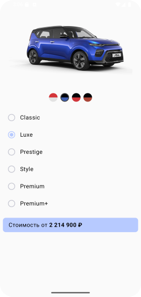

# Домашнее задание по теме "Radiobutton"

## Приложение “Конфигуратор авто”

На основе пройденного материала необходимо написать приложение «Конфигуратор авто». Приложение должно выводить на экран изображение автомобиля с помощью компонента `Image`, пользователь должен иметь возможность выбирать цвет автомобиля c помощью `RadioButton`’ов или `selectable` компонентов. Также пользователю должен быть предоставлен выбор комплектации автомобиля с помощью `RadioButton`’ов. В зависимости от выбранной комплектации должна меняться предполагаемая стоимость автомобиля, которая отображается в компоненте `Text`.

Конечный результат должен выглядеть примерно как в этом файле:

## Скриншоты домашнего задания

